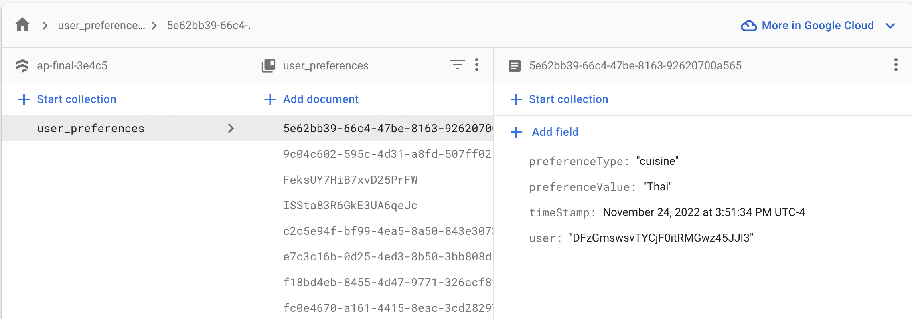

Keeping track of info required for project write up here:
https://www.cs.utexas.edu/users/witchel/371M/hw/writeup.html

Make sure your report specifies the following items, but bear in mind that the report is just your chance to convince me that you did a good job. 
Include what you think is necessary to convince me of that fact. 
I love hearing about debugging war stories. I'm serious, it is a problem for me.

## Team Members
- Althea Smith
  - ars_610@yahoo.com
  - ars7344
- Simon Weisser
  - simon.weisser@utexas.edu
  - saw3548

## Title 
Report the title of your app

## Description
Our app is designed to help individuals or groups decide on a location to eat based on their dining preferences. 
We pass the user or group's preferences as input to the Google Maps API to display details of the best nearby restaurants.  

## Screenshot
Include a screenshot of your app, hopefully one that illustrates key functionality.

## API(s)
List the APIs your app uses, for example Google maps. 
Also let me know if you use certain Android features extensively like animation or you have custom controllers (navigation drawer, action bar, etc.).

Google Places Text Search - this api was used for fetching restaurants based on the users dining preference, and has minimal details about the restaurant.
Google Places Details - this api was used for fetching specific details about one given restaurant (description, hours, reviews, etc)
Google Places Directions - this api was used for finding directions between the users starting location and the restaurant location.
FusedLocationProviderClient - used to find the current location of the Android device.

## Libraries
Material Design - We used this library to access additional components for our app like the Sliders found in the user preferences 
fragment. This library has fairly detailed documentation (https://m2.material.io/develop/android) which made it easy to set up and customize the components.

List all third party libraries you use, and what they do for your app (each in their own paragraph). 
Describe briefly what was good and/or challenging about using them.

## Services
List all third party services you use, and what they do for your app (each in their own paragraph).
Describe briefly what was good and/or challenging about using them.

Firebase Authentication - Authentication was used to allow users to sign in/ sign out to keep track
of their dining preferences. All dining preferences are linked to user UID's as seen in the DB schema below 
making it simple to fetch the current user's dining preferences when they are looking for a place to eat. 

Firestore Database - We used Firestore DB in order to keep track of our users' preferences from session to session. 
For this project we had to do research on batch transactions so we could update all of the preferences at once. 
I was pleased to find that Firestore has a set method which will create a document if 
one does not exist or update it if it does exist. This made storing/managing user preferences easy for both new and existing users. 

## UI/UX
Discuss anything noteworthy about your UI/UX/display code.

Nothing too complex here. We just have different views for the different functionality that users can click through. We use two recycle views, and also use google maps. We also have a button for calling the restaurant which is not possible to fully test using an emulator.

## Back End
Discuss anything noteworthy about your back end or processing logic.

We essentially make different API requests for the different functionality we have. When a user wants to select a restaurant to eat at, we load restaurants based on proximity, cuisine, and price. We list restaurants with their title, average rating, address and price. The user can also sort these results. If the user is interested in the restaurant, the can click on it and trigger another api call using the selected restaurants google places api id and we then display more detailed information such as a description, the hours, dining options and reviews. From the initial list of restaurants, the user can also hit directions where we then use FusedLocationProviderClient to get the users current address, and then using the restaurants address we make a call to google maps directions api to get the polylines and place it onto the map in the activity to show directions to the restaurant.

## Learnings / Challenges 
Discuss the most important or interesting thing you learned doing your project.
Discuss the most difficult challenge you overcame and/or your most interesting debugging story.

The most difficult challenge was getting the directions feature up and running. After initially realizing that I was not able to map out directions to the restaurant, I was able to figure out that the reason was the location of my emulator was accross the country in California. I figured out how I can change the location of my phone in the emulator. Afterwards, I was having issues using FusedLocationProviderClient to access my current location. After extensive debugging, I figured out that I was loading the map prior to actually fetching the current location. I was able to resolved this by loading the map within an on OnCompletionListener for the current address.

## Local Setup
1. Create and connect to a Firebase project: https://firebase.google.com/docs/android/setup
2. Enable Authentication and Firestore DB via the Firebase console
3. Set up API Key (for the sake of simplicity we left ours unrestricted)
4. If using an Emulator, make sure to change the location to represent your actual physical location.

If necessary, briefly tell us how to build and run your project. Include details about how to set back end services (if you use them). 
In the common case, we will rely on your demo, but just in case we have an issue, we'd like some tips.

## Database Schema

## Lines of Code

Report the count of lines of code in your project. Use cloc (http://cloc.sourceforge.net/) to count the lines. Run this command on your code.
cloc -by-file-by-lang app/src/main/
Report the total Java and total XML lines that you wrote. Do not include boilerplate lines, external libraries, or other sources in the total of lines on which you claim authorship.
Indicate how you calculate how many lines you authored if you report line totals. Maybe use a table.
You can break down the lines into modules if you think that helps, but I'm most interested in the totals of code you wrote.

## Code Frequency Graph (if available)
We want you to include the code frequency graph that github gives you for your repository. 
Open your project's github page in a web browser. Click the "Insights" tab. 
Then click the "Code frequency" tab on the menu bar on the left. You will see the "Code frequency" graph. 
Put a screen shot of your code frequency figure into your writeup. Here is an example figure for reference. 
If you don't have a pro account, or can't provide this data, that is ok.
